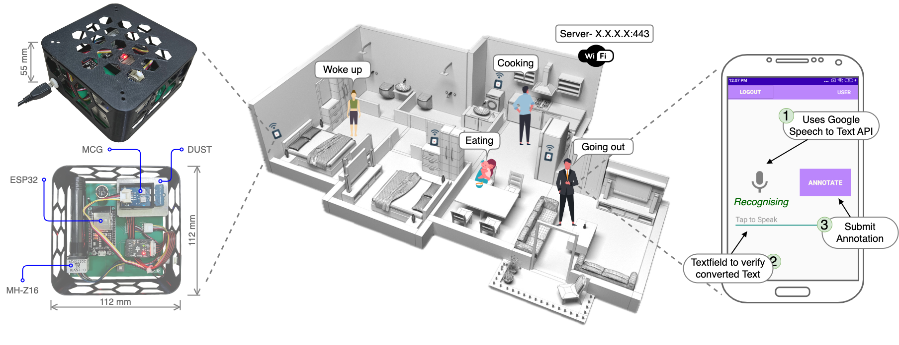

# DALTON-Dataset
We present spatiotemporal measurements of air quality from 30 indoor sites over six months during summer and winter seasons. The sites are geographically located across four regions of type: rural, suburban, and urban, covering the typical low to middle-income population in India. The dataset contains various types of indoor environments (e.g., studio apartments, classrooms, research laboratories, food canteens, and residential households), and can provide the basis for data-driven learning model research aimed at coping with unique pollution patterns in developing countries.

<p align="center">
      <br><strong>Fig.1:</strong> Overview of our extensive field study and data collection with multiple air quality monitors in a typical indoor environment.
</p>
In the dataset we have given comprehensive metadata for all the sensors and their placemant. The collected attributes from each sensor is as shown below.

| `Parameters` | `Description`                                                                                |
|------------|--------------------------------------------------------------------------------------------|
| ts         | Timestamp (yyyy/mm/dd HH:MM:SS) from the ESP32 MCU after reading sensor values             |
| T          | Temperature reading of the indoor environment in celsius at time ts                        |
| H          | Humidity reading of the indoor environment in percentage at time ts                        |
| PMS1       | Less than 1 micron dust particle readings in parts per million (ppm) at time ts            |
| PMS2_5     | Less than 2.5 micron dust particle readings in ppm at time ts                              |
| PMS10      | Less than 10 micron dust particle readings in ppm at time ts                               |
| CO2        | Carbon dioxide concentration in ppm at time ts                                             |
| NO2        | Nitrogen dioxide concentration in ppm at time ts                                           |
| CO         | Carbon monoxide concentration in ppm at time ts                                            |
| VoC        | Volatile organic compounds concentration in parts per billion (ppb) at time ts             |
| C2H5OH     | Ethyl alcohol concentration in ppb at time ts                                              |
| ID         | Unique identifier of the deployed \ourmethod{} sensor                                      |
| Loc        | Location of DALTON sensor in the indoor environment                                        |
| Customer   | The name of the occupant who participated during the sensor deployment in his indoor space |
| Ph         | Phone number of the customer for urgent contact. Replaced with XXXX to preserve privacy    |

# Installation
To install the required packages in your python(>=3.11) environment you need to run the below commands:
```bash
git clone https://github.com/prasenjit52282/dalton-dataset.git
cd dalton-dataset
pip install -r requirements.txt
```

# Data Preprocessing
Execute the following commands to preprocess the air quality measurements from RAW csv files to the organised and cleaned dataset:

* Merge Replicas for a Measurement Site 
    > ```python merge_replicas.py --customer NAME```
* Clean and Preprocess for a Measurement Site 
    > ```python preprocess_data.py --customer NAME --workers #cpus```
* Mark BreakPoints in the Data for a Measurement Site
    > ```python mark_breakpoints.py --customer NAME --workers #cpus  [--plot]```
* Compute Satistical Features from the Cleaned Dataset
    > ```python compute_feat.py --customer NAME --workers #cpus```


# Dataset Details
|Site ID|Dev IDs                                                                                                                                |#Dev|Site Area (sqft)|Floor Plan|#Female/ #Male|Data Duration (Hrs)|#Samples|Annot|Participants               |
|-------|---------------------------------------------------------------------------------------------------------------------------------------|--------|----------------|----------|--------------|-------------------|--------|-----------|---------------------------|
|H1     |41 42 43 44 45 |5       |1100            |yes       |1/1           |772                |11402870|yes        |P1 P2                      |
|H2     |13 17 16 14 12 15 |7       |1100            |yes       |2/2           |469                |8333689 |yes        |P3 P4 P5 P6                |
|H3     |62 63 61 |3       |1000            |yes       |1/1           |463                |4041058 |yes        |P7 P8                      |
|H4     |13 11 12 15 14 |5       |1200            |yes       |1/1           |2635               |24021924|no         |P9 P10                     |
|H5     |22 21 |2       |1200            |yes       |1/1           |2634               |7395189 |no         |P11 P12                    |
|H6     |114 113 111 112 115 |5       |400             |yes       |1/1           |218                |3188644 |yes        |P13 P14                    |
|H7     |71 72 |2       |400             |no        |1/1           |366                |2306882 |yes        |P15 P16                    |
|H8     |84 81 83 82 85 |5       |1100            |no        |2/1           |570                |8676832 |yes        |P1 P17 P18                 |
|H9     |98 99 |2       |300             |no        |1/1           |768                |3894082 |yes        |P19 P20                    |
|H10    |104 103 |2       |600             |no        |2/2           |25                 |70554   |no         |P21 P22 P23 P24            |
|H11    |107 106 |2       |600             |no        |1/2           |86                 |60098   |no         |P25 P26 P27                |
|H12    |94 93 |2       |216             |no        |1/1           |178                |1054696 |yes        |P19 P20                    |
|H13    |96 95 |2       |216             |no        |1/1           |127                |269824  |yes        |P19 P20                    |
|A1     |101 |1       |150             |no        |1/0           |146                |226888  |yes        |P28                        |
|A2     |105 |1       |150             |no        |0/1           |289                |193557  |no         |P29                        |
|A3     |109 |1       |180             |no        |0/1           |344                |1098827 |yes        |P30                        |
|A4     |120 |1       |150             |no        |1/0           |125                |384975  |no         |P31                        |
|A5     |121 |1       |150             |no        |1/0           |1                  |77      |yes        |P32                        |
|A6     |122 |1       |100             |no        |0/1           |51                 |154398  |yes        |P33                        |
|A7     |113 |1       |150             |no        |0/1           |55                 |54741   |yes        |P34                        |
|A8     |151 |1       |150             |no        |0/1           |60                 |189141  |no         |P35                        |
|R1     |54 51 53 52 |4       |522             |yes       |1/6           |834                |6203065 |yes        |P36 P37 P38 P39 P40 P41 P42|
|R2     |102 |1       |320             |yes       |2/2           |367                |1161570 |yes        |P43                        |
|R3     |108 |1       |616             |yes       |0/1           |243                |750745  |yes        |P44                        |
|R4     |21 24 22 23 |4       |522             |yes       |-             |371                |387195  |no         |-                          |
|R5     |73 72 71 |3       |600             |yes       |-             |179                |1583750 |no         |-                          |
|F1     |23 |1       |150             |yes       |2/0           |450                |631193  |no         |P46                        |
|F2     |24 |1       |150             |yes       |-             |450                |631193  |no         |-                          |
|C1     |25 |1       |500             |no        |-             |333                |590272  |no         |-                          |
|C2     |26 |1       |500             |no        |-             |53                 |158256  |no         |-                          |


# File Structure
```
.
├── ./Assets
│   └── ./Assets/system_diagram.png
├── ./Data
│   ├── ./Data/A1
│   │   └── ./Data/A1/101_Study_Desk.csv
│   ├── ./Data/H1
│   │   ├── ./Data/H1/41_Kitchen.csv
│   │   ├── ./Data/H1/[ID_Loc].csv         /* Files
│   │   └── ./Data/H1/45_Parent_room.csv
│   └── ./Data/[Site]                      /* Directories
│       └── ./Data/[Site]/[ID_Loc].csv
├── ./Merged
│   ├── ./Merged/data_A1.csv
│   └── ./Merged/data_[Site].csv           /* Files
├── ./Processed
│   ├── ./Processed/A1
│   │   ├── ./Processed/A1/2023_06_10
│   │   │   └── ./Processed/A1/2023_06_10/101_Study_Desk.csv
│   │   ├── ./Processed/A1/[Date]
│   │   │   └── ./Processed/A1/[Date]/[ID_Loc].csv  /* Files
│   │   └── ./Processed/A1/2023_06_16
│   │       └── ./Processed/A1/2023_06_16/101_Study_Desk.csv
│   └── ./Processed/[Site]                 /* Directories
│       └── ./Processed/[Site]/[Date]
│           └── ./Processed/[Site]/[Date]/[ID_Loc].csv
├── ./Features
│   ├── ./Features/A1
│   │   ├── ./Features/A1/2023_06_10_101_Study_Desk.csv
│   │   ├── ./Features/A1/[Date_ID_Loc].csv         /* Files
│   │   └── ./Features/A1/2023_06_16_101_Study_Desk.csv
│   └── ./Features/[Site]                  /* Directories
│       └── ./Features/A2/[Date_ID_Loc].csv
├── ./Metadata
│   ├── ./Metadata/Annotations.csv
│   ├── ./Metadata/Occupants.csv
│   └── ./Metadata/Site_wise_details.csv
├── ./library
│   ├── ./library/base_metrics.py
│   ├── ./library/breakpoints.py
│   ├── ./library/constants.py
│   ├── ./library/feat.py
│   ├── ./library/__init__.py
│   └── ./library/preprocess.py
├── ./merge_replicas.py
├── ./preprocess_data.py
├── ./mark_breakpoints.py
├── ./compute_feat.py
├── ./file_structure.txt
├── ./merge.sh
├── ./preprocess.sh
├── ./breakpoint.sh
├── ./features.sh
├── ./Makefile
├── ./LICENSE
├── ./README.md
└── ./requirements.txt

564 directories, 1454 files
```

# Reference
To refer the DALTON-dataset, please cite the following work.

BibTex Reference:
```
Coming Soon!
```
For questions and general feedback, contact [Prasenjit Karmakar](https://prasenjit52282.github.io/).

<!-- @article{karmakar2024communities,
  title={Indoor Air Quality Dataset with Activities of Daily Living in Low to Middle-income Communities},
  author={Karmakar, Prasenjit and Pradhan, Swadhin and Chakraborty, Sandip},
  year={2024}
} -->