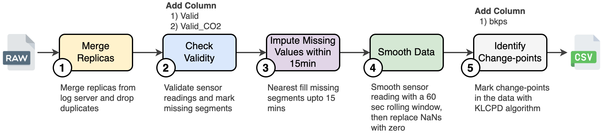

# DALTON-Dataset
We present spatiotemporal measurements of air quality from 30 indoor sites over six months during the summer and winter seasons (**89.1M samples, totaling 13646 hours of air quality data and 3957 activity annotations from 24 participants among 46 occupants**). The sites are geographically located across four regions of type: rural, suburban, and urban, covering the typical low to middle-income population in India. The dataset contains various indoor environments (e.g., studio apartments, classrooms, research laboratories, food canteens, and residential households). Fig. 1 shows the overview of the data collection setup in a typical indoor environment. Our dataset provides the basis for data-driven learning model research aimed at coping with unique pollution patterns in developing countries.

<p align="center">
      <br><strong>Fig.1:</strong> Overview of the field study and data collection with multiple air quality monitors in a typical indoor setup.
</p>

# Installation
To install the required packages in your python(>=3.11) environment you need to run the below commands:
```bash
git clone https://github.com/prasenjit52282/dalton-dataset.git
sudo apt-get update
sudo apt-get install make
cd dalton-dataset
pip install -r requirements.txt
```

# Attributes
We have given comprehensive metadata for all the sensors and their placemant in [Metadata](https://github.com/prasenjit52282/dalton-dataset/tree/main/Metadata) folder. The collected air quality and other necessary attributes from each sensor is as shown below.

| Parameters | Description                                                                                |
|------------|--------------------------------------------------------------------------------------------|
| <tt>ts</tt>         | Timestamp `yyyy/mm/dd HH:MM:SS` from the ESP32 MCU after reading sensor values             |
| <tt>T</tt>          | Temperature reading of the indoor environment in celsius at time ts                        |
| <tt>H</tt>          | Humidity reading of the indoor environment in percentage at time ts                        |
| <tt>PMS1</tt>       | Less than 1 micron dust particle readings in parts per million (ppm) at time ts            |
| <tt>PMS2_5</tt>     | Less than 2.5 micron dust particle readings in ppm at time ts                              |
| <tt>PMS10</tt>      | Less than 10 micron dust particle readings in ppm at time ts                               |
| <tt>CO2</tt>        | Carbon dioxide concentration in ppm at time ts                                             |
| <tt>NO2</tt>        | Nitrogen dioxide concentration in ppm at time ts                                           |
| <tt>CO</tt>         | Carbon monoxide concentration in ppm at time ts                                            |
| <tt>VoC</tt>        | Volatile organic compounds concentration in parts per billion (ppb) at time ts             |
| <tt>C2H5OH</tt>     | Ethyl alcohol concentration in ppb at time ts                                              |
| <tt>ID</tt>         | Unique identifier of the deployed sensor (e.g., `41`, `42`, etc.)                                     |
| <tt>Loc</tt>        | Location of the sensor in the indoor environment (e.g., `Kitchen`, `Bedroom`, etc.)                                       |
| <tt>Customer</tt>   | Participant name of the measurement site, replaced with `SiteID` to preserve privacy (`H1`-`H13`, `A1`-`A8`, `R1`-`R5`, `F1`, `F2`, `C1`, `C2`) as per [Metadata/Site_wise_details.csv](https://github.com/prasenjit52282/dalton-dataset/blob/main/Metadata/Site_wise_details.csv) |
| <tt>Ph</tt>         | Phone number of the customer for urgent contact, replaced with `XXXX` to preserve privacy    |

The raw activities and events (**in total 3957 annotations**) are stored in the `Annotations.csv` file of [Metadata](https://github.com/prasenjit52282/dalton-dataset/tree/main/Metadata) folder. As annotation may come from different occupants from the same site, we have given unique identifier to each participant (`P1` - `P46`). Each annotation is comprised of the following values.

| Parameters | Description                                                                                |
|------------|--------------------------------------------------------------------------------------------|
| <tt>ts</tt>         | Starting timestamp `yyyy/mm/dd HH:MM:SS` of the indoor event or activity             |
| <tt>Label</tt>          | Activity or event label (e.g., `Frying fish`, `AC off`, etc.) with detailed description (if possible) |
| <tt>Site</tt>          | `SiteID` of the measurement site that matches with `Customer` in the sensor attributed table  |
| <tt>Customer</tt>       | Unique participant identifier (`P1`-`P46`) as per [Metadata/Occupants.csv](https://github.com/prasenjit52282/dalton-dataset/blob/main/Metadata/Occupants.csv) |

The annotations can be associated with the sensor readings of any site to analyse the impact of indoor events and activities on the air pollution dynamics.

# Dataset Preparation

## Python scripts
Execute the following commands to preprocess the air quality measurements from raw csv files to the organised and cleaned dataset:

* Merge Replicas for a Measurement Site 
    > ```python merge_replicas.py --customer {SiteID}```
* Clean and Preprocess for a Measurement Site 
    > ```python preprocess_data.py --customer {SiteID} --workers #cpus```
* Mark BreakPoints in the Data for a Measurement Site
    > ```python mark_breakpoints.py --customer {SiteID} --workers #cpus  [--plot]```
<!-- * Compute Satistical Features from the Cleaned Dataset
    > ```python compute_feat.py --customer {SiteID} --workers #cpus``` -->

For convinence, we have provided the Makefile with the below commands to process the dataset from raw csvs (`./Data` folder) to processed csvs (`./Processed` folder). The repository contains all the processed files. However, the raw csvs can be downloaded and placed in the `./Data` folder from [Raw Data Files](https://iitkgpacin-my.sharepoint.com/:u:/g/personal/pkarmakar_kgpian_iitkgp_ac_in/EUJjN1c_gU9Jjh2Rj7ghDx8BZ0QWS42mP7gHXU80lHlmjg?e=nzshah) if needed.
```bash
make preprocess
```

## Preprocessing Steps
<p align="center">
      <br><strong>Fig.2:</strong> Data preprocessing pipeline.
</p>
The dataset is cleaned and organised with the above proprocessing pipeline in Fig. 2. Three new columns are computed from the sensor readings as shown in the figure. The utility of the derived columns are as follows:

+ `Valid` : A binary (1/0) column that represents whether all the pollutant readings are within measurement range of the sensors and no sensor is faulty.
+ `Valid_CO2` : A binary (1/0) column that represents whether CO2 sensor is working properly, as it frequently get impacted due to electrical surges in the indoor sites.
+ `bkps` : A binary column (1/0) that marks change-points in the data. The change-points (or also know as breakpoints) are computed with the Kernel change point detection ([KLCPD](https://centre-borelli.github.io/ruptures-docs/user-guide/detection/kernelcpd/)) algorithm from the ruptures python package.

Each raw file is processed with the above pipeline and stored in the `./Processed` folder. Note that the missing segments (> 15 mins) are replaced with `zero` values according to step(3 & 4) of the pipeline.

<p align="center">
      <br><strong>Fig.3:</strong> Annotation processing pipeline.
</p>

The raw annotation file `Annotations.csv` is cleaned and processed according to the pipeline shown in Fig. 3. The steps perform generic data cleaning and reformatting, anonymization, segregation of combined annotations, and spelling corrections to ensure the correctness and usability of the annotations. The cleaned annotations are available in the `Annotations_cleaned.csv` file of [Metadata](https://github.com/prasenjit52282/dalton-dataset/tree/main/Metadata) folder.

<strong>Note:</strong> Annotated `food` items are in local languages in some cases, based on the mother tongue of the annotator.

# File Structure

The compressed file structure by combining similar file paths with placeholders (i.e., `[Site]`,`[ID_Loc]`, etc.) is shown below. To see the complete file structure please refer to the [file_structure.txt](https://github.com/prasenjit52282/dalton-dataset/blob/main/file_structure.txt) file.
```
.
├── ./Assets
│   ├── ./Assets/Preprocess.png
│   ├── ./Assets/Preprocess_annot.png
│   └── ./Assets/system_diagram.png
├── ./Data                                                               /* Raw Dataset
│   ├── ./Data/A1
│   │   └── ./Data/A1/101_Study_Desk.csv
│   ├── ./Data/H1
│   │   ├── ./Data/H1/41_Kitchen.csv
│   │   ├── ./Data/H1/[ID_Loc].csv                                       /* Files
│   │   └── ./Data/H1/45_Parent_room.csv
│   └── ./Data/[Site]                                                    /* Directories
│       └── ./Data/[Site]/[ID_Loc].csv
├── ./Merged
│   ├── ./Merged/data_A1.csv
│   └── ./Merged/data_[Site].csv                                         
├── ./Processed                                                          /* Processed Dataset
│   ├── ./Processed/A1
│   │   ├── ./Processed/A1/2023_06_10
│   │   │   └── ./Processed/A1/2023_06_10/101_Study_Desk.csv
│   │   ├── ./Processed/A1/[Date]
│   │   │   └── ./Processed/A1/[Date]/[ID_Loc].csv                       
│   │   └── ./Processed/A1/2023_06_16
│   │       └── ./Processed/A1/2023_06_16/101_Study_Desk.csv
│   └── ./Processed/[Site]                                               
│       └── ./Processed/[Site]/[Date]
│           └── ./Processed/[Site]/[Date]/[ID_Loc].csv
├── ./Metadata                                                           /* Metadata
│   ├── ./Metadata/Annotations.csv
│   ├── ./Metadata/Annotations_cleaned.csv
│   ├── ./Metadata/Occupants.csv
│   └── ./Metadata/Site_wise_details.csv
├── ./library
│   ├── ./library/base_metrics.py
│   ├── ./library/breakpoints.py
│   ├── ./library/constants.py
│   ├── ./library/feat.py
│   ├── ./library/__init__.py
│   └── ./library/preprocess.py
├── ./merge_replicas.py
├── ./preprocess_data.py
├── ./mark_breakpoints.py
├── ./compute_feat.py
├── ./file_structure.txt
├── ./merge.sh
├── ./preprocess.sh
├── ./breakpoint.sh
├── ./features.sh
├── ./Makefile
├── ./LICENSE
├── ./README.md
└── ./requirements.txt

565 directories, 1458 files
```


# Dataset Diversity

|Site ID|#Dev|Site Area (sqft)|Floor Plan|#F/ #M|Duration (Hrs)|#Samples|Annot|Participants|
|-------|--------|----------------|----------|--------------|-------------------|--------|-----------|-------|
|H1     |5       |1100            |:heavy_check_mark:       |1/1           |772                |11402870|:heavy_check_mark:        |P1 P2                      |
|H2     |7       |1100            |:heavy_check_mark:       |2/2           |469                |8333689 |:heavy_check_mark:        |P3 P4 P5 P6                |
|H3     |3       |1000            |:heavy_check_mark:       |1/1           |463                |4041058 |:heavy_check_mark:        |P7 P8                      |
|H4     |5       |1200            |:heavy_check_mark:       |1/1           |2635               |24021924|:heavy_minus_sign:         |P9 P10                     |
|H5     |2       |1200            |:heavy_check_mark:       |1/1           |2634               |7395189 |:heavy_minus_sign:         |P11 P12                    |
|H6     |5       |400             |:heavy_check_mark:       |1/1           |218                |3188644 |:heavy_check_mark:        |P13 P14                    |
|H7     |2       |400             |:heavy_minus_sign:        |1/1           |366                |2306882 |:heavy_check_mark:        |P15 P16                    |
|H8     |5       |1100            |:heavy_minus_sign:        |2/1           |570                |8676832 |:heavy_check_mark:        |P1 P17 P18                 |
|H9     |2       |300             |:heavy_minus_sign:        |1/1           |768                |3894082 |:heavy_check_mark:        |P19 P20                    |
|H10    |2       |600             |:heavy_minus_sign:        |2/2           |25                 |70554   |:heavy_minus_sign:         |P21 P22 P23 P24            |
|H11    |2       |600             |:heavy_minus_sign:        |1/2           |86                 |60098   |:heavy_minus_sign:         |P25 P26 P27                |
|H12    |2       |216             |:heavy_minus_sign:        |1/1           |178                |1054696 |:heavy_check_mark:        |P19 P20                    |
|H13    |2       |216             |:heavy_minus_sign:        |1/1           |127                |269824  |:heavy_check_mark:        |P19 P20                    |
|A1     |1       |150             |:heavy_minus_sign:        |1/0           |146                |226888  |:heavy_check_mark:        |P28                        |
|A2     |1       |150             |:heavy_minus_sign:        |0/1           |289                |193557  |:heavy_minus_sign:         |P29                        |
|A3     |1       |180             |:heavy_minus_sign:        |0/1           |344                |1098827 |:heavy_check_mark:        |P30                        |
|A4     |1       |150             |:heavy_minus_sign:        |1/0           |125                |384975  |:heavy_minus_sign:         |P31                        |
|A5     |1       |150             |:heavy_minus_sign:        |1/0           |1                  |77      |:heavy_check_mark:        |P32                        |
|A6     |1       |100             |:heavy_minus_sign:        |0/1           |51                 |154398  |:heavy_check_mark:        |P33                        |
|A7     |1       |150             |:heavy_minus_sign:        |0/1           |55                 |54741   |:heavy_check_mark:        |P34                        |
|A8     |1       |150             |:heavy_minus_sign:        |0/1           |60                 |189141  |:heavy_minus_sign:         |P35                        |
|R1     |4       |522             |:heavy_check_mark:       |1/6           |834                |6203065 |:heavy_check_mark:        |P36 P37 P38 P39 P40 P41 P42|
|R2     |1       |320             |:heavy_check_mark:       |2/2           |367                |1161570 |:heavy_check_mark:        |P43                        |
|R3     |1       |616             |:heavy_check_mark:       |0/1           |243                |750745  |:heavy_check_mark:        |P44                        |
|R4     |4       |522             |:heavy_check_mark:       |:heavy_minus_sign:             |371                |387195  |:heavy_minus_sign:         |:heavy_minus_sign:                          |
|R5     |3       |600             |:heavy_check_mark:       |:heavy_minus_sign:             |179                |1583750 |:heavy_minus_sign:         |:heavy_minus_sign:                          |
|F1     |1       |150             |:heavy_check_mark:       |2/0           |450                |631193  |:heavy_minus_sign:         |P46                        |
|F2     |1       |150             |:heavy_check_mark:       |:heavy_minus_sign:             |450                |631193  |:heavy_minus_sign:         |:heavy_minus_sign:                          |
|C1     |1       |500             |:heavy_minus_sign:        |:heavy_minus_sign:             |333                |590272  |:heavy_minus_sign:         |:heavy_minus_sign:                          |
|C2     |1       |500             |:heavy_minus_sign:        |:heavy_minus_sign:             |53                 |158256  |:heavy_minus_sign:         |:heavy_minus_sign:                          |

The above table summarizes the overall deployment, user participation, and data collection scale across 30 diverse sites spread across four geographic regions in India. The processed dataset is stored in the `./Processed` folder. The corresponding activity annotations and metadata are stored in the `./Metadata` folder of the repository. Notably, the raw data files can be downloaded from [here](https://iitkgpacin-my.sharepoint.com/:u:/g/personal/pkarmakar_kgpian_iitkgp_ac_in/EUJjN1c_gU9Jjh2Rj7ghDx8BZ0QWS42mP7gHXU80lHlmjg?e=nzshah).

# License and Consent
The dataset is free to download and can be used with `GNU Affero General Public License` for non-commercial purposes. All participants signed forms consenting to the use of collected pollutant measurements and activity labels for non-commercial research purposes. The institute's ethical review committee has approved the field study (`Order No: IIT/SRIC/DEAN/2023`, Dated July 31, 2023). Moreover, we have made significant efforts to anonymize the participants to preserve privacy while providing the necessary information to encourage future research with the dataset.

# Reference
To refer the DALTON-dataset, please cite the following work.

BibTex Reference:
```
@article{karmakar2024indoor,
  title={Indoor Air Quality Dataset with Activities of Daily Living in Low to Middle-income Communities},
  author={Karmakar, Prasenjit and Pradhan, Swadhin and Chakraborty, Sandip},
  journal={arXiv preprint arXiv:2407.14501},
  year={2024}
}
```
For questions and general feedback, contact [Prasenjit Karmakar](https://prasenjit52282.github.io/).
